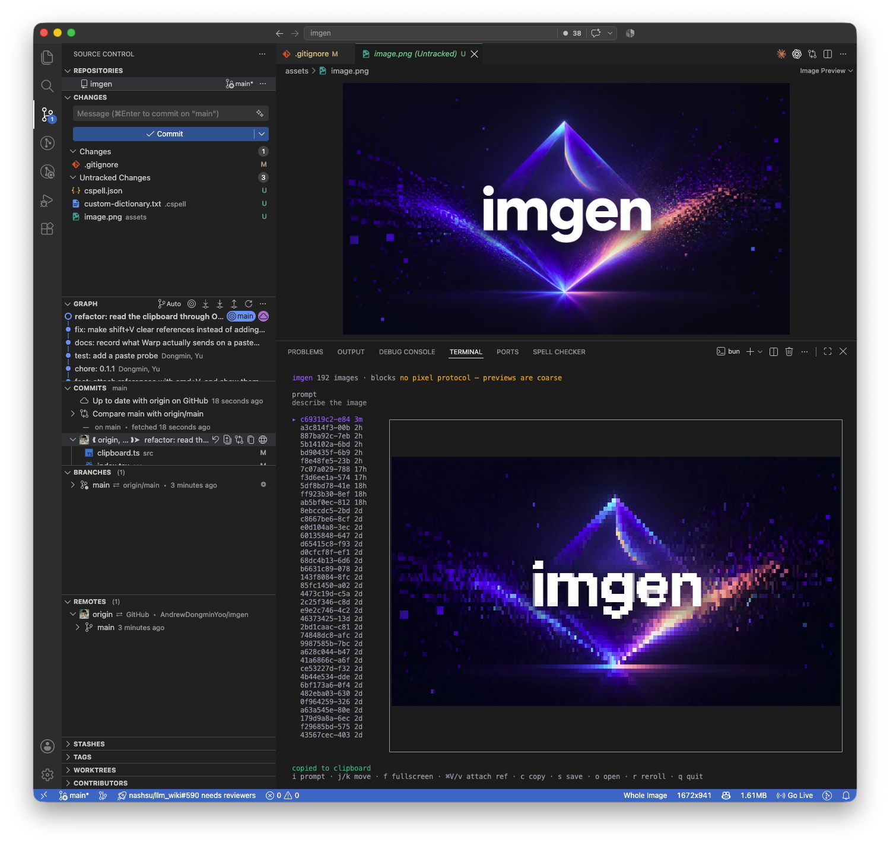

# 

A terminal browser and generator for the images the Codex CLI makes.

Type a description, watch the candidate appear in the terminal at full size, keep it or roll again.
Every image Codex has ever generated on this machine is already in the gallery.

Built with [OpenTUI](https://github.com/sst/opentui).

## Why it exists

Codex has no `imagegen` subcommand — the image tool only runs inside an agent turn, so generating
one image from a script means a whole headless `codex exec`.
That is fine for a single asset and miserable for the thing you actually do, which is generate a
few candidates and look at them.
`imgen` keeps the loop in one place: prompt, preview, re-roll, save.

## Install

```bash
bun install
bun link          # exposes `imgen` on PATH
```

Requires the [Codex CLI](https://github.com/openai/codex), authenticated, with its image tool
enabled — `codex features list` should show `image_generation stable true`.

## Use

```bash
imgen
```

| Key        | Action                                                     |
| ---------- | ---------------------------------------------------------- |
| `i`        | focus the prompt; `enter` generates                        |
| `/`        | filter the gallery by prompt; `enter` applies, `esc` clears |
| `enter`    | read the prompt in full; `j`/`k` scroll it, `c` copies it  |
| `tab`      | let Codex flesh out the draft — composition, light, style  |
| `shift+enter` or `option+enter` | new line in the prompt                 |
| `j`/`k`    | move through the gallery                                   |
| `f`        | hide the gallery and fill the screen                       |
| `⌘V`       | attach the image on the clipboard as a reference           |
| `v`        | the same thing, for terminals that swallow `⌘V`            |
| `x`        | remove every attached reference                            |
| `c`        | copy the selected image to the clipboard                   |
| `p`        | copy its path instead, as text                             |
| `s`        | save the selected image into the current directory         |
| `o`        | open it in the system viewer                               |
| `r`        | roll the selected image's prompt again, or the last one    |
| `esc`      | cancel a running generation                                |
| `q`        | quit                                                       |

## Fleshing out a prompt

`tab` in the prompt hands your draft to Codex and asks it to decide what you left open —
composition and framing, lighting, colour, medium, mood, aspect ratio — while keeping your
subject exactly as written. It also asks for no lettering, which these models render badly.

The result replaces the draft **in the editor**, not in a generation. Read it, edit it, then
press enter. A rewrite that quietly became the prompt would be worse than no rewrite.

```log
a fox on a bicycle
  ↓ tab
Flat vector illustration of a fox on a bicycle, shown in a side-on full-body view riding along
a gently curved park path … muted sage grass, dusty blue sky, warm terracotta path … with no
lettering, text, logos, or watermarks.
```

A rewrite is its own Codex turn, so it is not instant — 36s for the example above. `esc` stops
it.

### New lines

A new line is any modified return — `shift+enter`, `option+enter`, `ctrl+enter`, `cmd+enter`.
More than one is bound because terminals disagree about which of them reaches an application:
`shift` and `ctrl` arrive as flags only where the kitty keyboard protocol is on, while
`option+enter` comes through as a bare return whose byte sequence carries an escape prefix.
Both routes are verified in Warp, which speaks the kitty protocol — `shift+enter` arrives as
`ESC[13;2u` with the flag set, `option+enter` as `ESC[13;3u`. The same keys reach a terminal
without it as a bare return with an escape prefix and no flags at all, which is why both shapes
are accepted rather than one.

`ctrl+J` is deliberately **not** bound. Terminals disagree about it more sharply — without the
kitty protocol it is the raw `0x0A` byte, with it the letter `j` plus a ctrl flag — and the
modified returns already cover the need.

Run with `IMGEN_KEY_LOG=/tmp/imgen-keys.log` to see what your terminal delivers for any key,
alongside what the editor did with it.

## What made each picture

A generation records its prompt against every image it produced, in
`~/.config/imgen/prompts.json`. The gallery then labels the image with the prompt instead of its
hex filename, and `/` filters the library down to the prompts that contain what you type. `r`
rolls the selected image's own prompt again — "this one, differently" — falling back to the
session's last prompt for an image it has no record of.

A label is 22 characters and a prompt is a paragraph, so `enter` opens the whole thing in a
scrollable box below the picture, `j`/`k` scrolling it and `c` copying it while it is open —
`c` copies whatever you are looking at, which in there is the text rather than the picture.
It sits beside the image rather than over it: a kitty placement is drawn by the terminal itself
rather than into the cell grid, so which one wins where they overlap is the emulator's decision
and not something this side can settle. Splitting the pane looks the same in all three protocols.

Only imgen's own runs are recorded, so a filter necessarily hides everything Codex made before
this existed; the filter line says so, and how many of the library are left.

Recovering the older prompts was measured and rejected rather than skipped. The session rollout
survives for most of them — 19 of 20 sampled — but `session_index.json` names none of the 62
library sessions, and the image tool is reached differently from one session to the next (a
built-in tool in some, a skill through `exec` in others), so there is no single shape to parse.
Recording forward is exact; excavating backwards would be a guess wearing a label.

### Standing style

`~/.config/imgen/config.json`:

```json
{
  "style": "flat vector, muted palette, no gradients"
}
```

Free text, appended to every rewrite, and `null` by default.
It is one string rather than a schema of palette and lighting and camera fields because the model
already reads a sentence as an instruction, and the schema would only be a worse way to write it.

## Reference images

`⌘V` attaches the image on the clipboard to the next prompt, which reaches Codex through
`codex exec -i`. Attached references are drawn as thumbnails above the status line, so what is
going with the prompt is visible rather than counted.

`⌘V` never arrives as a keypress — the terminal turns it into a paste — and what it puts in that
paste varies, so three routes are handled.

| What the terminal sends | Route |
| ----------------------- | ------ |
| the path of an image file, as text | copied in |
| anything else | the pasteboard is read directly, by mime type |

Pasted *text* stops at the prompt editor, so writing a prompt while an image happens to be
copied never attaches it by accident.

The pasteboard read is OpenTUI's native clipboard, asked for `image/png`, `image/tiff` or
`image/jpeg` — so it does not depend on the terminal forwarding anything, and it is not
macOS-only. `osascript` remains as a fallback for the documented `unsupported` status.

Measured in Warp: copying a file in Finder pastes its full path, and copying image data pastes
an empty string. `v` triggers the pasteboard read explicitly if your terminal does something
else again with `⌘V`.

`bun run probe:paste` prints what your terminal actually sends.
Pasted images are written to `~/.codex/attachments/<session>/image-N.png`, the same place and the
same naming Codex uses for images pasted into one of its own sessions.

Writing an image *to* the pasteboard (`c`) still goes through `osascript` and the `«class PNGf»`
type, which the native clipboard does not cover. Either way there is no `pngpaste` or other
Homebrew helper to install.

A generation is a full Codex agent turn: it takes minutes and costs tokens, so the run is spawned
rather than awaited — `esc` kills the child at any point.
While it runs you get a spinner, the elapsed seconds, and the last line Codex printed.
There is no percentage because the turn does not report one; motion and Codex's own output are the
honest signals.

## Terminals

The preview quality is a property of your terminal, not of this tool.
`imgen` prints which protocol it resolved in the header.

| Protocol | Meaning                                          | Seen in                    |
| -------- | ------------------------------------------------ | -------------------------- |
| `kitty`  | true pixels                                      | Warp                       |
| `sixel`  | true pixels                                      | —                          |
| `blocks` | half-block approximation, the universal fallback | VS Code integrated terminal |

**A terminal without a pixel protocol is a supported terminal, not a degraded one.**
`blocks` draws the image with half-block characters and 24-bit colour, which is coarse but
perfectly enough to tell candidates apart, pick one, and re-roll — the loop this tool exists for.
Nothing is disabled: the gallery, reference thumbnails, generation and saving all behave the
same, and the header says `blocks` so you know why the preview looks the way it does.



Run `bun run probe:protocol` in any terminal to see what it reports there.
This has to be run in the terminal itself: capability detection is a query the emulator answers,
so asking from another process's pty always comes back `blocks`.

## How a run is identified

Codex writes every image under `~/.codex/generated_images/<session>/`.
`imgen` snapshots that directory before launching and diffs it afterwards.

Reading the newest file instead would be wrong twice over: one run can emit several images into a
single session directory, and against a library of any size a run that produced nothing would hand
back an unrelated earlier picture instead of reporting the failure.

## Development

```bash
bun test
bunx tsc --noEmit
python3 dev/measure.py bun run src/index.tsx   # compare preview size between layouts
```

`dev/ptyrun.py` runs the app under a real pty and prints what it drew, which is the only way to see
a TUI from a script. `dev/quitcheck.py` measures how long a quit key takes to actually exit.

## Notes

This wraps the Codex CLI (Apache-2.0); it does not bundle or redistribute it, and it uses your own
Codex authentication. Generated images are subject to OpenAI's usage policies.
